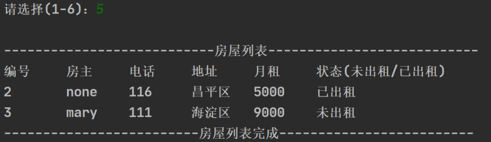
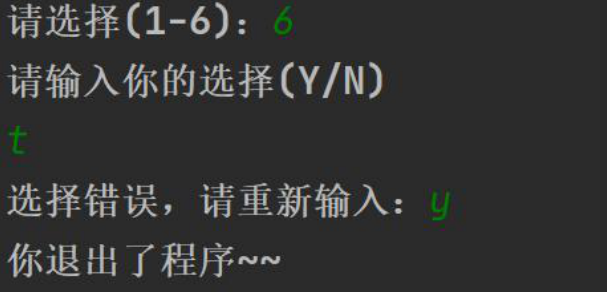

# 房屋出租系统

## 需求清单

### 项目界面

#### 主菜单

#### 新增房源

#### 查找房源

#### 删除房源

#### 修改房源

#### 房屋列表

#### 退出系统

## 项目设计

需求分析：一共6个功能模块，采用简单的分层模式管理系统功能

> 分层模式：有利于代码的复用，也利于功能的扩展。

### 业务功能类

HouseView.java: 
1. 显示界面
2. 接收用户的输入
3. 调用其他类（HouseService）完成对房屋信息的各种操作

HouseService.java:
1. 响应HouseView的调用
2. 完成对房屋信息的各种操作（crud，即增删改查）

House.java: 
1. 封装房屋信息，一个House对象表示一个对象信息

### 时序图分析

