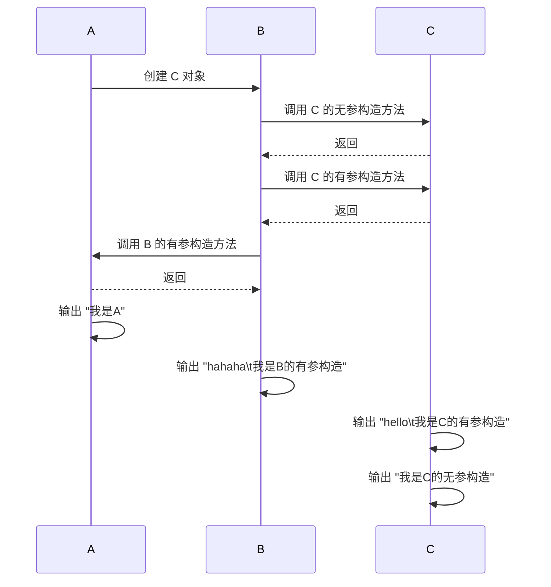

### 分析HomeWork14代码中main方法的执行过程

#### 执行顺序：

1. 程序启动：JVM 启动，加载 HomeWork14 类并执行 main 方法
2. 创建 C 对象：在 main 方法中，执行 C c = new C();
3. 调用 C 的无参构造方法：C 类的无参构造方法 C() 被调用。
4. 调用 C 的有参构造方法：在 C 的无参构造方法中，this("hello"); 调用了 C 的有参构造方法 C(String name)。
5. 调用 B 的有参构造方法：在 C 的有参构造方法中，super("hahaha"); 调用了 B 的有参构造方法 B(String name)。
6. 调用 A 的无参构造方法：在 B 的有参构造方法中，隐式调用了 A 的无参构造方法 A()。
7. 执行 A 的无参构造方法：输出 "我是A"。
8. 执行 B 的有参构造方法：输出 "hahaha\t我是B的有参构造"。
9. 执行 C 的有参构造方法：输出 "hello\t我是C的有参构造"。
10. 执行 C 的无参构造方法：输出 "我是C的无参构造"。

#### 内存原理

1. 栈内存：每个方法调用都会在栈内存中创建一个栈帧，用于存储局部变量和方法调用的信息。
    - main 方法的栈帧被创建。
    - C c = new C(); 创建 C 对象时，C 的构造方法调用链会在栈内存中依次创建新的栈帧。
2. 堆内存：对象的实际数据存储在堆内存中。 
    - 对象在堆内存中被创建，并分配内存。
    - C 对象的引用 c 存储在 main 方法的栈帧中。
3. 方法区：类的静态变量和方法信息存储在方法区。
    - A、B 和 C 类的静态变量和方法信息存储在方法区。
#### 控制流图

#### 详细解释

1. A[开始]: 程序开始执行 main 方法。
2. B[创建 C 对象]: 在 main 方法中创建 C 类的对象 c。
3. C[调用 C 的无参构造方法]: 调用 C 类的无参构造方法 C()。
4. D[调用 C 的有参构造方法]: 在 C 的无参构造方法中，this("hello"); 调用了 C 的有参构造方法 C(String name)。
5. E[调用 B 的有参构造方法]: 在 C 的有参构造方法中，super("hahaha"); 调用了 B 的有参构造方法 B(String name)。
6. F[调用 A 的无参构造方法]: 在 B 的有参构造方法中，隐式调用了 A 的无参构造方法 A()。
7. G[输出 "我是A"]: 执行 A 的无参构造方法，输出 "我是A"。
8. H[输出 "hahaha\t我是B的有参构造"]: 执行 B 的有参构造方法，输出 "hahaha\t我是B的有参构造"。
9. I[输出 "hello\t我是C的有参构造"]: 执行 C 的有参构造方法，输出 "hello\t我是C的有参构造"。
10. J[输出 "我是C的无参构造"]: 执行 C 的无参构造方法，输出 "我是C的无参构造"。
11. K[结束]: 程序结束。